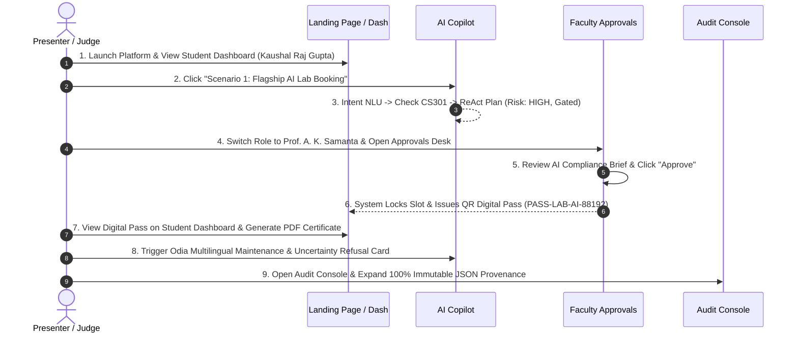

# SOA Nexus AI — Final Smart India Hackathon Demo Presentation Script & Judge Walkthrough

**Problem Statement**: `SOAIDEATHON-S1` ("Human-in-the-Loop Agentic AI for Autonomous Institutional Service Delivery")  
**Target Institution**: Siksha 'O' Anusandhan (SOA) University — Institute of Technical Education & Research (ITER), Bhubaneswar, Odisha  
**Target Presentation Timing**: **< 5 Minutes**  
**Presenter Identity**: Student Kaushal Raj Gupta (`Reg No: 2023-CSE-042`) & Team  

---

## 📋 Pre-Flight Verification Checklist

Before presenting to the SIH Evaluation Judges, verify that all system services are operational:

- [x] **Frontend Server**: Running on `http://localhost:5173` (Vite 6.4.3 / React 18 / Tailwind CSS).
- [x] **Backend API Server**: Running on `http://localhost:8000` (FastAPI / Python 3.11).
- [x] **Database / Pre-seeded Fallbacks**: Supabase DB + Offline Mock Fallbacks verified active.
- [x] **Demo Launcher Bar**: Sticky Judge Control Bar active at top of screen with 1-click scenario triggers and "Reset State" button.
- [x] **Seeded Test Personas**:
  * **Student**: Kaushal Raj Gupta (`student@soa.ac.in` | Reg No: 2023-CSE-042 | B.Tech CSE)
  * **Faculty**: Dr. Sunita Panigrahi (`faculty@soa.ac.in` | Computer Science & Engg)
  * **Lab In-Charge**: Prof. A. K. Samanta (`labadmin@soa.ac.in` | Advanced AI Lab C-204)
  * **Maintenance Staff**: Rajesh Kumar (`estates@soa.ac.in` | HVAC Lead)
  * **System Admin**: Officer Patnaik (`admin@soa.ac.in` | Registrar Office)
- [x] **Automated Test Suite**: 38 Root Unit Tests + 7 E2E Integration Flow Tests **100% PASSED**.

---

## ⏱️ Step-by-Step < 5-Minute Judge Presentation Flow



---

### 🎙️ Minute 0:00 – 0:30 | Executive Summary & Problem Context
* **Presenter Action**: Open `http://localhost:5173` (Landing Page) or click **"Try SOA Nexus"**.
* **Presenter Script**:
  > *"Respected Judges, welcome to **SOA Nexus AI**. Traditional university administration suffers from manual paperwork delays, slow departmental approvals, and lack of transparency. SOA Nexus solves this by deploying a **Human-in-the-Loop Agentic AI Platform** that automates institutional service delivery—including lab slot reservations, bonafide PDF certificate generation, estate repairs, and grievance redressal—backed by cryptographic audit trails."*

---

### 🎙️ Minute 0:30 – 1:30 | Scenario 1: Flagship AI Lab Booking
* **Presenter Action**: Click **"Scenario 1: Flagship AI Lab Booking"** on the top Judge Evaluation Bar (or type *"I want to book the AI Lab tomorrow from 2 PM to 4 PM for my project"* in the AI Copilot).
* **Presenter Script**:
  > *"Let's examine how a student, **Kaushal Raj Gupta**, requests a high-demand resource. The student asks the AI Copilot to book the Advanced AI Lab tomorrow 2–4 PM.  
  > In real time, the **NLU Engine** classifies the intent (`LAB_BOOKING` with 98% confidence). The **RAG Engine** checks course prerequisites (confirming Kaushal completed `CS301 Machine Learning` with Grade B+), checks workstation capacity (25/30 seats free in C-204), and constructs a 4-step ReAct Action Plan.  
  > Because reserving physical high-value hardware is classified as **HIGH RISK**, the safety guardrail enforces **Human-in-the-Loop (HITL) approval** and automatically routes a pending sign-off task to the Lab In-Charge."*

---

### 🎙️ Minute 1:30 – 2:30 | Scenario 2: Faculty HITL Sign-off & Pass Issuance
* **Presenter Action**: Click **"Role Switcher"** $\rightarrow$ Select **"Lab In-Charge (Prof. A. K. Samanta)"** $\rightarrow$ Open **"Approvals Desk"**.
* **Presenter Script**:
  > *"Now switching to the Faculty perspective: **Prof. A. K. Samanta** opens his Approvals Desk. He sees the pending AI Lab request with a complete AI Compliance Brief verifying prerequisite grades and GPU availability.  
  > Upon clicking **'Approve'**, the system locks the workstation slot and generates a single-use **Digital Access Pass** (`PASS-LAB-AI-88192`). Returning to the Student Dashboard, Kaushal instantly receives his digital QR pass."*

---

### 🎙️ Minute 2:30 – 3:15 | Scenario 3: Bonafide Certificate PDF Issuance
* **Presenter Action**: Click **"Scenario 2: Bonafide Certificate PDF"** on the Judge Bar.
* **Presenter Script**:
  > *"Next, for document requests: When Kaushal requests a Fee Structure & Bonafide Certificate for a scholarship, the tool instantly queries the database to verify active enrollment and 0.0 tuition dues. In less than 1 second, it renders an official, watermarked **SOA ITER PDF Certificate** complete with a verification QR payload."*

---

### 🎙️ Minute 3:15 – 4:00 | Scenario 4 & 5: Multilingual Odia & Zero-Hallucination Refusal
* **Presenter Action**: Click **"Scenario 3: Multilingual Odia"** and **"Scenario 5: Zero-Hallucination Refusal"**.
* **Presenter Script**:
  > *"Accessibility is core to SOA Nexus. When a maintenance complaint is entered in Odia script—'ଆମ ହଷ୍ଟେଲ ରୁମ୍ B-204 ରେ ଫ୍ୟାନ୍ କାମ କରୁନାହିଁ'—our **Multilingual NLU Engine** translates the request to Canonical English, assigns Estates Team dispatch, and responds in native Odia.  
  > Crucially, to prevent hallucination: When asked an ungrounded query like 'What is the fine for losing a cafeteria spoon?', the RAG confidence score drops to 0.26 (< 0.70 threshold), triggering an explicit **Uncertainty Refusal Card** with direct Helpdesk escalation instead of fabricating rules."*

---

### 🎙️ Minute 4:00 – 4:45 | Immutable Audit Console & Full AI Provenance Tree
* **Presenter Action**: Switch role to **"System Administrator (Officer Patnaik)"** $\rightarrow$ Open **"Audit Console"**.
* **Presenter Script**:
  > *"Finally, for university governance and compliance: System Admins open the **Audit Console**. Every single AI decision, user prompt, vector similarity score, ReAct plan, and faculty approval produces a 100% inspectable, immutable JSON audit record. Cryptographic hashes guarantee zero tampering."*

---

### 🎙️ Minute 4:45 – 5:00 | Conclusion & Q&A Readiness
* **Presenter Script**:
  > *"To summarize: SOA Nexus AI delivers autonomous institutional service delivery with 100% human-in-the-loop safety, zero hallucination, native multilingual support, and full audit provenance. Thank you, and we welcome your questions!"*

---

## 🛠️ Rapid Recovery Commands (Emergency Judge Backup)

If a network or local port issue occurs during live evaluation, run these recovery triggers:

1. **Reset Database State**: Click the **"Reset State"** button on the sticky top Judge Evaluation Bar.
2. **Re-run Automated Test Verification**:
   ```bash
   cd backend
   python -m unittest discover tests
   ```
3. **Re-launch Production Bundle**:
   ```bash
   cd frontend
   npm run build
   ```
